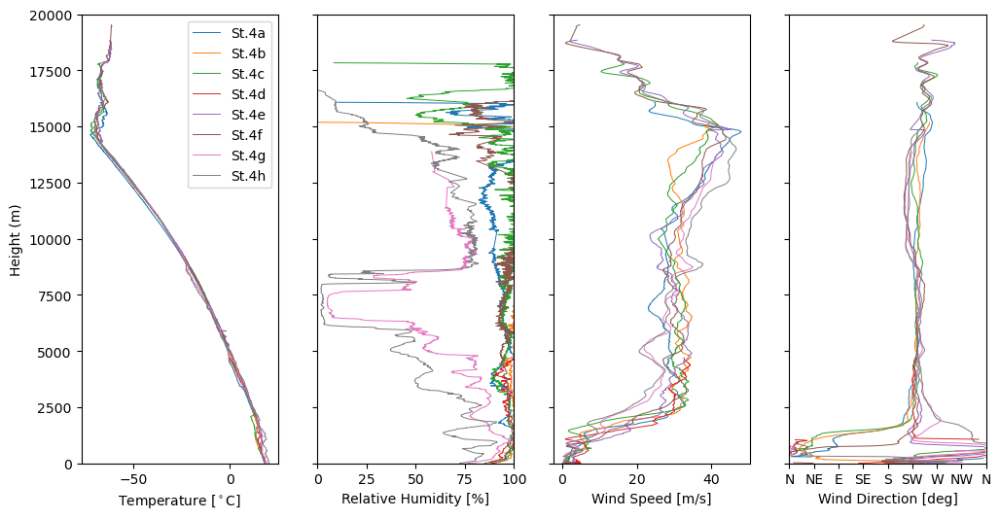
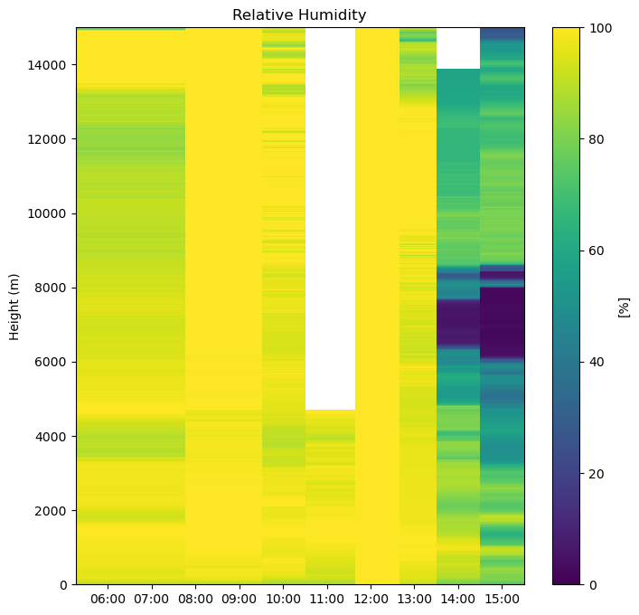
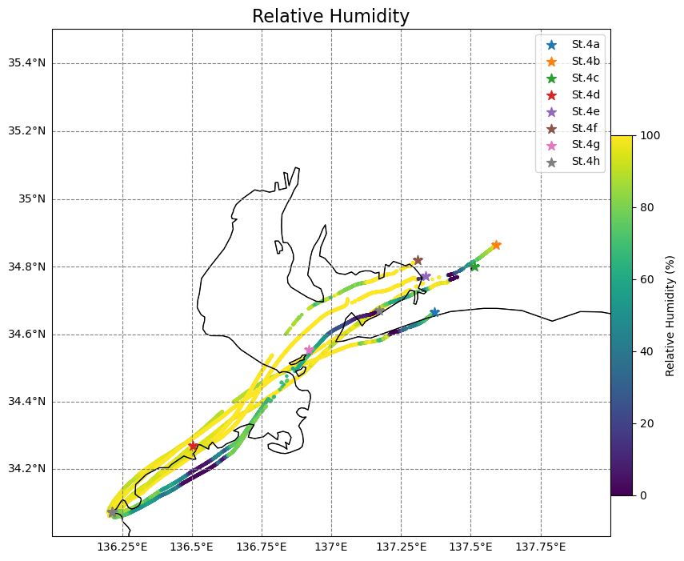
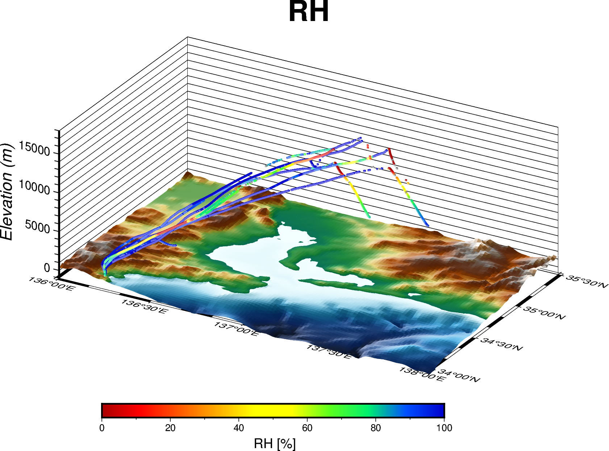
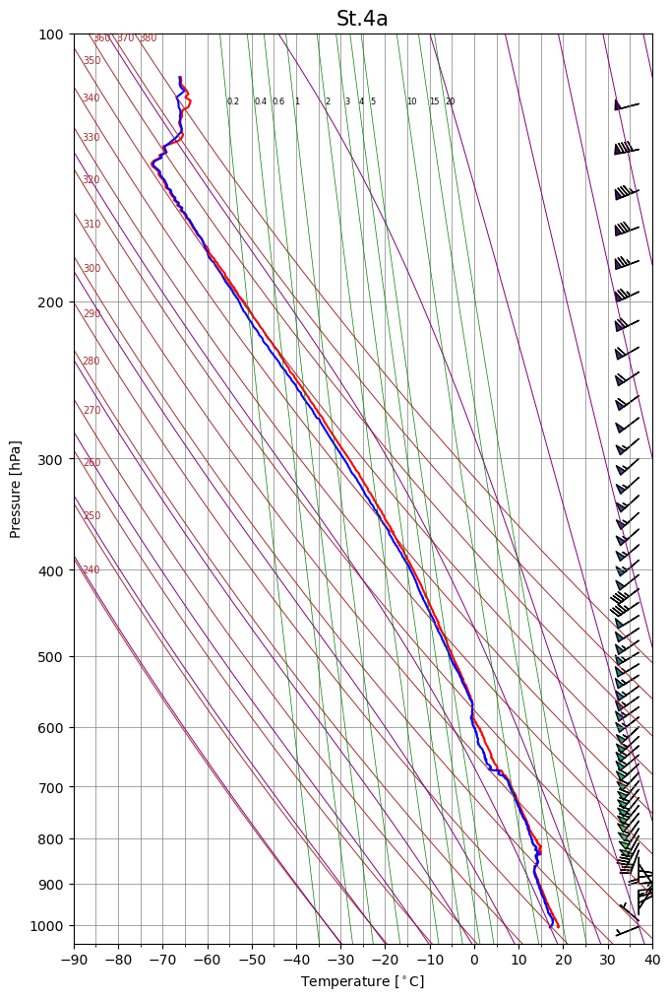

# bsod2
BSoD2(BalloonScope on Deck 2) is a package in Python for reading and visualizing radiosonde data.

## requirements

## Installation
This package can be installed from PyPI.
```
pip install bsod2
```

## Usage
## Sample plots
### data
Sample data was observed in Seisui-maru 2407 cruise
(2024年度　三重大学　陸海空・環境科学実習).
- [raw data](sample/Seisuimaru2407/raw_data/)
- [field book(pdf)](sample/Seisuimaru2407/2407オペレーター野帳.pdf)

### z vs. sonde variables plot
<p align="center">
 
</p>

See [z_vs_var.ipynb](sample/z_vs_var.ipynb) for more details.

### time-z cross section plot
<p align="center">
  
</p>

See [vertcal_csec.ipynb](sample/vertical_csec.ipynb) for more details.

### 2D/3D trajectories plot
<p align="center">
  
  
</p>
<p align="center">
  
</p>

See [trajectory.ipynb](sample/trajectory.ipynb) for more details.
### emagram
<p align="center">
 
</p>

See [emagram.ipynb](sample/emagram.ipynb) for more details.
## Licence
This project is distributed under the terms of the GNU General Public License, Version 3 (GPLv3).  
See the [LICENSE](LICENSE) file for details.